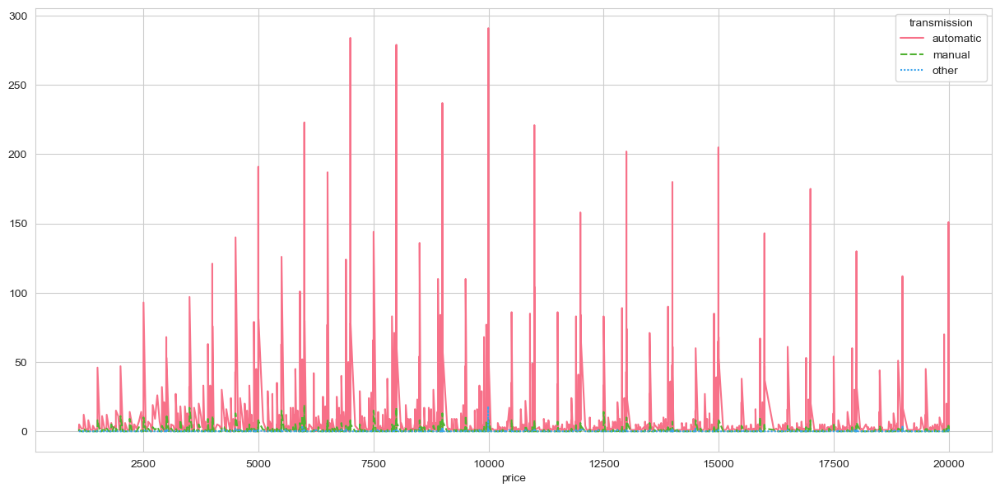
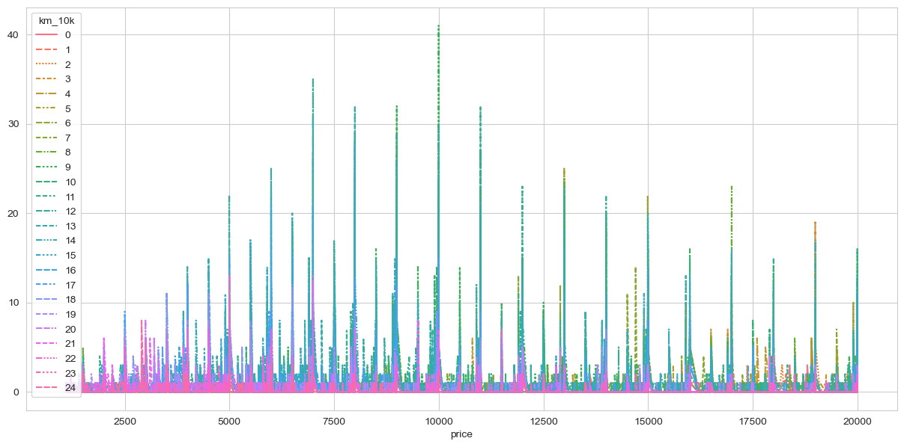

# Recommendation for Used Car Dealers – Factors Affecting Car Prices

## Context

The dataset utilized for this analysis was sourced from Kaggle. The original dataset encompassed details on 3 million used cars. However, for the sake of processing efficiency, the provided dataset has been curated to include information on 426K cars.

## Goal

The objective of this analysis is to discern the factors that influence the pricing of cars, determining whether they make a vehicle more or less costly. Following the analysis, the aim is to offer precise recommendations to a used car dealership. These recommendations will elucidate what aspects consumers place value on when considering a used car purchase.

## Jupyter Notebook

## Content

When selling used cars, it's crucial to consider several factors that can significantly influence the price of a car. These factors include:

1. **Aging (Age):** The age of a car is one of the primary determinants of its price. Older cars typically have a lower market value compared to newer ones.

2. **Transmission:** The type of transmission, whether it's manual or automatic, can impact a car's price. Automatic transmissions are often preferred and may command a higher price.

3. **Odometer (km):** The mileage on a car's odometer is a critical factor. Lower mileage often means less wear and tear, which can lead to a higher selling price.

4. **Number of Cylinders:** The engine configuration, specifically the number of cylinders, affects a car's performance and fuel efficiency. Cars with more cylinders may have higher prices due to their potential for better performance.

Consider these factors carefully when pricing your used cars, as they play a significant role in attracting potential buyers and determining the final sale price.

### Factor 1: Car age 
#### Sales Trends by Car Age

The graphic below illustrates the sales trends based on the age of cars. It highlights that the highest level of sales is observed for cars with an age of 9 years, followed closely by cars aged 10 years and 8 years.

<figure>
    
    <figcaption>Sales Trends by Car Age</figcaption>
</figure>

#### Price by Age Chart

For a more detailed view of how car prices vary with age, please refer to the "Price by Age" chart provided below:

<figure>
    
    <figcaption>Price by Age Chart</figcaption>
</figure>

### Factor 2: Car transmission 
#### Transmission Type Recommendation for Used Car Dealers

#### Transmission/Price Chart

To better understand the relationship between transmission types and car prices, please refer to the chart below:

<figure>
    
    <figcaption>Transmission/Price Chart</figcaption>
</figure>

This chart will provide valuable insights into how different transmission types impact the pricing of used cars.

When it comes to the transmission types in the used car market, statistics show that automatic transmissions dominate the scene, accounting for a substantial 90% of used car sales. Manual and other transmission types, on the other hand, represent a minor portion of the market.

**Recommendation:** Considering this market trend, it is advisable for used car dealers to focus their business primarily on vehicles equipped with automatic transmissions. This alignment with the prevailing consumer preference can help optimize sales and cater to the broader demand for automatic transmission vehicles.

### Factor 3: Odometer(km)

#### Odometer(km)/Price Chart

To gain a better understanding of how odometer readings in kilometers (km) correlate with car prices, please consult the chart provided below:

<figure>
    
    <figcaption>Odometer(km)/Price Chart</figcaption>
</figure>

This chart will help illustrate the relationship between odometer readings and the pricing of used cars.

#### Odometer Range for Optimal Used Car Sales

For optimal results in selling used cars, it's crucial to consider the odometer reading. The "Good range" of odometer readings falls between 70,000 km and 160,000 km. Within this range, you can expect to sell used cars quite effectively.

However, it's essential to note that when the odometer reading falls below 70,000 km or rises above 160,000 km, the number of sold cars significantly decreases. Buyers tend to favor vehicles within this specific mileage range, as it often indicates a well-balanced usage history and, consequently, a higher level of interest in the market.

### Factor 4: Number of Cylinders

In assessing used car pricing, one crucial factor to consider is the number of cylinders in the vehicle's engine. This factor can have a significant impact on both performance and market demand. The chart below provides an overview of the distribution of cars by the number of cylinders:

<figure>
    
    <figcaption>Number of Cylinders Chart</figcaption>
</figure>

From the chart, it's evident that cars with 4, 6, and 8 cylinders dominate the market, collectively covering a major market share. Understanding the popularity of these cylinder configurations can help you make informed decisions when pricing and selling used cars.

#### In-Depth Analysis of 4, 6, and 8 Cylinder Cars

To gain a more comprehensive understanding of the market dynamics, we conducted a deeper analysis specifically focused on cars with 4, 6, and 8 cylinders. This analysis sheds light on critical insights that can significantly impact your decision-making process when dealing with these cylinder configurations.

Please refer to the chart below for the detailed findings:

<figure>
    
    <figcaption>In-Depth Analysis Chart</figcaption>
</figure>

This chart will provide valuable insights into the pricing and sales trends of cars with 4, 6, and 8 cylinders, enabling you to make more informed decisions in your used car dealership.

#### Market Share Analysis by Cylinder Type

In our analysis of the market share based on the number of cylinders, we found the following distribution:

- **4 Cylinders:** Covering a significant 42% of the market share.
- **6 Cylinders:** Holding a substantial 34% of the market share.
- **8 Cylinders:** Accounting for 24% of the market share.

Please refer to the chart below for the detailed findings:

<figure>
    
    <figcaption>In-Depth Analysis Chart</figcaption>
</figure>

**Recommendation:** Given this market share breakdown, it is advisable to concentrate your used car dealership business on vehicles equipped with 4, 6, and 8 cylinders. These cylinder configurations collectively represent the vast majority of the market, ensuring a broader customer base and increased sales potential. Vehicles with other numbers of cylinders may have limited demand, so focusing on these three categories is likely to yield the best results.

### Price range of used cars

When it comes to pricing used cars, customer preferences play a crucial role. Our analysis reveals that customers tend to favor prices with even numbers, such as 5000 USD, 6000 USD, 7000 USD, 8000 USD, 9000 USD, 10000 USD, 11000 USD, 12000 USD, 13000 USD, 14000 USD, 15000 USD, and so on.

**Popular Price Range:** The most sought-after price range falls between 6000 USD and 13000 USD.

To delve deeper into these pricing trends and their correlation with 4, 6, and 8 cylinder cars, please refer to the chart below:

<figure>
    
    <figcaption>Price Analysis Chart</figcaption>
</figure>

This chart provides insights into the pricing patterns for cars with different cylinder configurations, helping you make informed decisions regarding your used car inventory.
